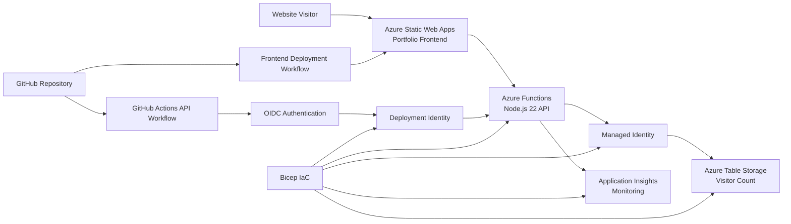

# Azure Cloud Resume Application

A live Microsoft Azure portfolio application built to demonstrate cloud deployment, serverless application support, identity-based security, monitoring, automated delivery, and Infrastructure as Code (IaC).

**Live Portfolio:** [https://kind-field-03372af10.7.azurestaticapps.net](https://kind-field-03372af10.7.azurestaticapps.net)

## Project Overview

This project is part of my transition from the U.S. Army into cloud support, Azure operations, systems administration, and Microsoft-focused technical support roles through the Microsoft Software and Systems Academy (MSSA) Server and Cloud Administration pathway.

The application includes:

- A public portfolio frontend hosted on Azure Static Web Apps.
- A live visitor-counter Application Programming Interface (API) hosted on Azure Functions.
- Persistent visitor data stored in Azure Table Storage.
- Managed Identity and Azure Role-Based Access Control (RBAC) for secure storage access.
- Application Insights telemetry for API monitoring.
- GitHub Actions deployment automation using OpenID Connect (OIDC).
- Azure backend infrastructure deployed through Bicep Infrastructure as Code (IaC).

## Live Architecture



## How the Application Works

When a user visits the live portfolio site:

1. The frontend loads from Azure Static Web Apps.
2. JavaScript calls the Azure Function API endpoint.
3. The Azure Function authenticates to Azure Table Storage through Managed Identity.
4. The stored visitor count is read and incremented.
5. The updated number is returned to the webpage.
6. Application Insights captures API telemetry for monitoring.

## Azure Services and Technologies

| Technology | Purpose |
|---|---|
| Azure Static Web Apps | Hosts the public portfolio frontend |
| Azure Functions | Runs the serverless visitor-counter API |
| Azure Table Storage | Stores the persistent visitor count |
| Managed Identity | Authenticates the Function App to storage without embedded keys |
| Azure RBAC | Grants scoped access to required resources only |
| Application Insights | Captures API telemetry and request performance |
| GitHub Actions | Automates backend application deployment |
| OpenID Connect (OIDC) | Enables passwordless GitHub-to-Azure authentication |
| Bicep | Defines and deploys Azure backend infrastructure through code |
| Node.js 22 / JavaScript | Implements the serverless API |
| HTML / CSS / JavaScript | Implements the portfolio frontend |
| PowerShell / Azure CLI | Used for deployment, testing, and Azure administration |

## Security Design

This project was built to avoid common beginner-project shortcuts such as exposed storage keys or overly broad permissions.

### Managed Identity Storage Access

The Azure Function does not store or use an Azure Storage account key in application code. It authenticates through a dedicated user-assigned managed identity.

### Scoped RBAC Permissions

The Function runtime identity has only the required storage roles:

- **Storage Blob Data Owner** for secured Function deployment-package storage.
- **Storage Table Data Contributor** for reading and updating visitor-counter data.

A separate GitHub deployment identity is assigned deployment access only to the Azure Function App.

### Hardened Storage Account

The Azure Storage account is configured with:

- HTTPS-only traffic required.
- Minimum Transport Layer Security (TLS) version set to TLS 1.2.
- Public blob access disabled.
- Shared-key access disabled.

### Restricted Frontend-to-API Access

Cross-Origin Resource Sharing (CORS) is configured so browser-based API calls are accepted from the deployed Azure Static Web App origin rather than broadly allowing all websites.

### Passwordless Deployment Authentication

The backend deployment workflow uses GitHub Actions with OpenID Connect (OIDC) and an Azure federated identity credential. This avoids storing a long-lived Azure password or publish-profile credential in GitHub.

## Deployment Automation

### Frontend Deployment

The frontend deploys automatically to Azure Static Web Apps when website changes are pushed to the `main` branch.

### Backend Deployment

The backend workflow is located at:

```text
.github/workflows/deploy-api.yml
```

When backend source code changes are pushed to `main`, GitHub Actions:

1. Checks out the repository.
2. Configures Node.js 22.
3. Installs the API dependencies.
4. Authenticates to Azure through OIDC.
5. Deploys the Azure Function API.

## Infrastructure as Code

The Bicep blueprint is located at:

```text
infra/main.bicep
```

The Bicep deployment manages the backend architecture, including:

- Secured Azure Storage configuration.
- Private Function deployment-package container.
- Function runtime managed identity.
- GitHub deployment managed identity.
- Federated OIDC trust for the GitHub repository `main` branch.
- Application Insights monitoring.
- Flex Consumption Function hosting plan.
- Azure Function API configuration.
- Managed-identity application settings.
- CORS restrictions.
- Scoped RBAC role assignments.

The existing Azure Static Web App is referenced by the Bicep blueprint for CORS configuration without replacing its established GitHub-connected frontend deployment resource.

## Monitoring Validation

Application Insights was verified against the live Azure Function API. Successful requests to the visitor-counter endpoint were captured with HTTP `200` responses, request timing telemetry, and Function invocation tracking.

This confirms the API is observable after deployment and that operational telemetry is available for troubleshooting.

## Local Development and Testing

Before live deployment, the visitor-counter API was tested locally with:

- Azure Functions Core Tools.
- Azurite local Azure Storage emulation.
- PowerShell API requests.

Local API endpoint:

```text
http://localhost:7071/api/visitors
```

Validated local behavior:

```text
First API request  -> count: 1
Second API request -> count: 2
```

## Repository Structure

```text
azure-cloud-resume/
├── .github/
│   └── workflows/
│       ├── azure-static-web-apps-*.yml
│       └── deploy-api.yml
├── api/
│   ├── src/
│   │   └── functions/
│   │       └── visitorCount.js
│   ├── host.json
│   ├── package.json
│   └── package-lock.json
├── docs/
│   └── architecture.md
├── frontend/
│   ├── index.html
│   ├── script.js
│   └── styles.css
├── infra/
│   └── main.bicep
├── .gitignore
└── README.md
```

## Skills Demonstrated

This project demonstrates hands-on experience with:

- Azure-hosted web application deployment.
- Serverless API development and testing.
- Azure Table Storage data persistence.
- Managed Identity authentication.
- Azure RBAC permission design and cleanup.
- Azure Storage security configuration.
- CORS configuration.
- Application Insights monitoring.
- GitHub Actions deployment automation.
- OIDC-based passwordless Azure authentication.
- Bicep Infrastructure as Code deployment.
- Git and GitHub version-controlled project delivery.

## Future Portfolio Projects

### Secure Azure Identity and Access Support Lab

A Microsoft Entra ID and Azure RBAC-focused support environment demonstrating access workflows, auditing, PowerShell automation, and operational monitoring.

### AI-Enabled Cloud Support Knowledge Assistant

An Azure artificial intelligence-enabled support tool demonstrating grounded troubleshooting guidance, incident classification, escalation support, and responsible artificial intelligence controls.

## About Me

I am a U.S. Army Sergeant transitioning into cloud and systems support through the Microsoft Software and Systems Academy (MSSA) Server and Cloud Administration pathway.

My military experience includes secure identity and credentialing operations, authorized access workflows, personnel systems support, onboarding coordination, user training, process improvement, and operational accountability supporting brigade-level organizations.

I am targeting roles in:

- Azure Support
- Cloud Operations
- Systems Administration
- Microsoft Technical Support
- Identity-Enabled IT Operations

## Connect

- LinkedIn: [https://www.linkedin.com/in/frankiedeleon/](https://www.linkedin.com/in/frankiedeleon/)
- GitHub: [https://github.com/frankierdeleonjr-cmyk](https://github.com/frankierdeleonjr-cmyk)
- Live Portfolio: [https://kind-field-03372af10.7.azurestaticapps.net](https://kind-field-03372af10.7.azurestaticapps.net)
