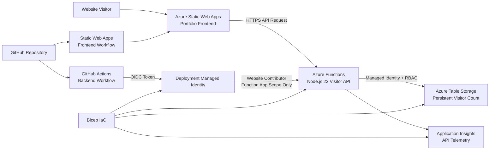

# Azure Cloud Resume Application: Technical Architecture

## Purpose

This document records the architecture, security controls, deployment model, operational validation, and design decisions for the Azure Cloud Resume Application built by Frankie R. DeLeon Jr.

The application is a live cloud-hosted portfolio project designed to demonstrate practical capability in Microsoft Azure, serverless application support, identity-based access, cloud monitoring, deployment automation, and Infrastructure as Code (IaC).

## Live Application Endpoints

| Component | Endpoint |
|---|---|
| Public portfolio frontend | `https://kind-field-03372af10.7.azurestaticapps.net` |
| Visitor counter API | `https://func-azure-cloud-resume-frd2026.azurewebsites.net/api/visitors` |

## Architecture Summary

The application consists of a static frontend hosted by Azure Static Web Apps and a serverless backend hosted by Azure Functions. The frontend calls an HTTP-triggered API endpoint to retrieve and increment a persistent visitor count. The API accesses Azure Table Storage by using a user-assigned managed identity rather than embedded storage keys. Application Insights captures API telemetry. GitHub Actions deploys backend code through OpenID Connect (OIDC), and Bicep defines and deploys the backend infrastructure.



## Azure Resource Inventory

| Resource | Azure Service | Purpose |
|---|---|---|
| `swa-azure-cloud-resume-prod` | Azure Static Web Apps | Hosts the public portfolio frontend on the Free tier |
| `func-azure-cloud-resume-frd2026` | Azure Functions | Runs the HTTP-triggered visitor counter API |
| `ASP-rgazurecloudresumeprod-9b98` | Azure Functions Flex Consumption plan | Provides serverless compute for the Function App |
| `stcloudresumefrd2026` | Azure Storage account | Provides private Function deployment package storage and Table Storage for visitor count data |
| `id-func-cloud-resume-prod` | User-assigned managed identity | Runtime identity used by the Function App for storage access |
| `id-github-deploy-cloud-resume-prod` | User-assigned managed identity | Deployment identity used by GitHub Actions through OIDC |
| `func-azure-cloud-resume-frd2026` | Application Insights | Captures API request telemetry and performance information |
| Existing connected Log Analytics workspace | Log Analytics | Stores workspace-based Application Insights telemetry |

## Request and Data Flow

When a visitor loads the portfolio site, the following process occurs:

1. Azure Static Web Apps serves the HTML, CSS, and JavaScript frontend.
2. Frontend JavaScript sends an HTTPS `GET` request to `/api/visitors` on the Azure Function App.
3. Cross-Origin Resource Sharing (CORS) allows the request from the deployed Static Web App origin.
4. The Function App executes the `visitorCount` function using Node.js 22.
5. In Azure, the function authenticates to Azure Storage through its user-assigned managed identity.
6. The function reads the existing visitor-count table entity, increments the numeric value, and updates the entity using its entity tag (`etag`) to reduce concurrent update conflicts.
7. The API returns the updated count to the frontend as JSON.
8. The frontend renders the visitor number on the live portfolio page.
9. Application Insights records request telemetry for operational monitoring.

## Visitor Counter Data Model

The visitor counter is stored as an Azure Table Storage entity.

| Data Attribute | Value / Purpose |
|---|---|
| Table name | `VisitorCounts` |
| Partition key | `portfolio` |
| Row key | `site` |
| `count` property | Stores the current visitor total |

### Concurrency Handling

The API reads the entity and supplies the current `etag` during updates. If two requests attempt to update the same entity at the same time, the application retries the update rather than silently losing one of the increments. This addresses a common weakness in simple visitor-counter implementations.

## Frontend Hosting Design

### Service

The frontend is hosted on **Azure Static Web Apps** using the Free plan.

### Frontend Responsibilities

- Displays the professional portfolio content.
- Loads the visitor-counter JavaScript logic.
- Calls the live API endpoint over HTTPS.
- Displays a user-friendly fallback message if the API is unavailable.

### Deployment Model

Azure Static Web Apps is connected to the GitHub repository and deploys frontend changes from the `main` branch through the generated Static Web Apps workflow.

### Bicep Boundary

The existing Static Web App is referenced in `infra/main.bicep` as an existing resource only to build the approved CORS origin for the backend API. The Bicep deployment does not recreate or replace the established GitHub-connected frontend resource.

## Backend API Design

### Service

The visitor API is hosted on **Azure Functions** using a **Flex Consumption** plan.

| Configuration | Value |
|---|---|
| Runtime | Node.js 22 |
| Hosting model | Flex Consumption (`FC1`) |
| API route | `/api/visitors` |
| Trigger type | Anonymous HTTP `GET` trigger |
| HTTPS only | Enabled |
| Always-ready instances | None configured |

### Why Flex Consumption

Flex Consumption provides a serverless execution model appropriate for a small portfolio application. The API does not require a dedicated always-running server, and it can execute on demand when the site receives visitors.

### Function Responsibilities

- Receive the visitor request.
- Authenticate to storage using managed identity in Azure.
- Create the count entity when it does not yet exist.
- Read and increment the existing count.
- Handle concurrent update conditions through retries.
- Return JSON containing the updated count.
- Log execution information for Application Insights.

## Storage Design and Security Controls

### Storage Responsibilities

The Azure Storage account provides:

1. Private Blob Storage for the packaged Azure Function deployment artifact.
2. Azure Table Storage for the persistent visitor-count entity.

### Storage Security Configuration

| Control | Configuration | Purpose |
|---|---|---|
| HTTPS-only traffic | Enabled | Prevents non-encrypted storage requests |
| Minimum TLS version | TLS 1.2 | Enforces an acceptable transport security baseline |
| Public blob access | Disabled | Prevents anonymous public access to blob content |
| Shared-key access | Disabled | Prevents dependence on storage account key authentication |
| Deployment package container | Private | Protects deployed Function code package storage |

## Identity and Access Model

The project uses two separate user-assigned managed identities to separate runtime access from deployment access.

### Runtime Identity: `id-func-cloud-resume-prod`

Used by the Function App when it needs to access Azure Storage.

| Azure RBAC Role | Scope | Reason Required |
|---|---|---|
| Storage Blob Data Owner | Storage account | Enables secured Function deployment-package storage access for the Flex Consumption Function App |
| Storage Table Data Contributor | Storage account | Enables the API to read and update the visitor-count table entity |

A redundant `Storage Blob Data Contributor` assignment identified during validation was removed. The application was retested after the cleanup and continued to function successfully.

### Deployment Identity: `id-github-deploy-cloud-resume-prod`

Used only by GitHub Actions when deploying backend API code.

| Azure RBAC Role | Scope | Reason Required |
|---|---|---|
| Website Contributor | Specific Function App only | Enables GitHub Actions to deploy API code without broader subscription or resource-group control |

### Security Rationale

Using separate identities supports least-privilege separation:

- Runtime access is limited to application data and Function package storage requirements.
- Deployment access is limited to publishing code to the Function App.
- No storage account key is embedded in code.
- No long-lived Azure deployment password is stored in GitHub.

## Authentication and Configuration

### Azure Function Runtime Storage Authentication

The Function runtime is configured to use managed identity for its Azure storage connection through identity-based application settings:

| Setting | Purpose |
|---|---|
| `AzureWebJobsStorage__accountName` | Identifies the Storage account used by Azure Functions |
| `AzureWebJobsStorage__credential` | Tells Azure Functions to use managed identity |
| `AzureWebJobsStorage__clientId` | Selects the Function runtime user-assigned identity |

### Application Visitor Data Authentication

| Setting | Purpose |
|---|---|
| `TABLE_STORAGE_ENDPOINT` | Provides the Azure Table Storage endpoint to the API code |
| `AZURE_CLIENT_ID` | Selects the user-assigned identity used by the Azure SDK |

### Monitoring Configuration

| Setting | Purpose |
|---|---|
| `APPLICATIONINSIGHTS_CONNECTION_STRING` | Routes Function API telemetry to Application Insights |

## Cross-Origin Resource Sharing (CORS)

The browser-based API request is restricted to the public Azure Static Web App origin:

```text
https://kind-field-03372af10.7.azurestaticapps.net
```

This allows the portfolio website to call the API while avoiding an unrestricted `*` browser origin configuration.

## Monitoring and Operational Validation

### Monitoring Service

The Function App is monitored through **Application Insights**, configured in workspace-based mode with telemetry stored in its connected Log Analytics workspace.

| Monitoring Property | Value |
|---|---|
| Application Insights component | `func-azure-cloud-resume-frd2026` |
| Monitoring mode | Log Analytics workspace-based ingestion |
| Retention observed in configuration | 90 days |

### Validation Performed

Monitoring was tested against the live visitor API. Successful `visitorCount` requests appeared in Application Insights with:

- HTTP `200` response codes.
- Recorded response durations.
- Function request events associated with the `/api/visitors` endpoint.

This confirms the API is not only deployed but observable for troubleshooting and performance monitoring.

## Deployment Automation

### Frontend Delivery Pipeline

The frontend deploys through the Azure Static Web Apps GitHub workflow when frontend changes are pushed to `main`.

```text
Frontend file update -> Git commit -> GitHub push -> Azure Static Web Apps workflow -> Live frontend update
```

### Backend Delivery Pipeline

The backend workflow is stored in:

```text
.github/workflows/deploy-api.yml
```

It triggers when API files or the backend workflow change on the `main` branch.

```text
API code update -> Git commit -> GitHub push -> GitHub Actions -> OIDC login -> Azure Function deployment
```

### OIDC Authentication Flow

The backend pipeline uses OpenID Connect rather than a stored Azure password:

1. GitHub Actions starts from the trusted repository `main` branch.
2. Azure validates the federated identity credential subject for that branch.
3. GitHub receives a short-lived token for the deployment identity.
4. The deployment identity publishes code to the Function App under its scoped role.

This deployment workflow was executed successfully and the live API was tested afterward to confirm the visitor counter continued to function.

## Infrastructure as Code (IaC)

### Bicep File

The project’s Azure backend infrastructure is defined in:

```text
infra/main.bicep
```

### Resources Managed Through Bicep

The Bicep blueprint defines and applies:

- Secured Azure Storage account configuration.
- Private Function deployment package container.
- Runtime managed identity.
- GitHub deployment managed identity.
- GitHub OIDC federated identity credential.
- Application Insights monitoring configuration.
- Flex Consumption hosting plan.
- Azure Function App runtime and deployment configuration.
- Managed-identity application settings.
- CORS configuration referencing the existing Static Web App origin.
- Scoped Role-Based Access Control assignments.

### Safe Adoption of Existing Resources

Because resources were originally created during guided build-out, the Bicep blueprint was not deployed blindly. The process was:

1. Inventory the existing live Azure resources.
2. Capture security, identity, monitoring, hosting, and storage configuration.
3. Build the Bicep blueprint locally.
4. Compile the Bicep file with no errors.
5. Run an Azure `what-if` preview.
6. Remove proposed changes that could disturb the GitHub-connected Static Web App.
7. Deploy the reviewed backend blueprint.
8. Retest the API and live website after deployment.

### Deployment Result

The Bicep deployment completed successfully, and the visitor-counter API continued incrementing data afterward. This validated both the infrastructure definition and continued application functionality after the live configuration was applied through code.

## Local Development and Testing

### Tools Used

| Tool | Purpose |
|---|---|
| Azure Functions Core Tools | Run the Function API locally |
| Azurite | Emulate Azure Storage locally without using live cloud data |
| PowerShell | Invoke and test local and live API endpoints |
| Git | Record milestones and configuration changes |
| Azure CLI | Configure and validate Azure resources |
| Bicep CLI | Build, preview, and deploy infrastructure definitions |

### Local Test Flow

```text
Local Function API -> Azurite Table Storage -> Persistent incrementing visitor count
```

The API was tested locally before live deployment and confirmed to increment from `1` to `2`. After the managed-identity implementation was added, it was retested locally before publishing to Azure.

## Key Technical Decisions

| Decision | Reason |
|---|---|
| Azure Static Web Apps for frontend | Simple hosted frontend with GitHub-based deployment workflow |
| Azure Functions Flex Consumption for API | Serverless execution appropriate for low-volume portfolio traffic |
| Azure Table Storage for count data | Lightweight persistent data model suited to a single counter entity |
| Managed identity instead of storage key | Removes stored cloud credentials from application code |
| Separate runtime and deployment identities | Separates application access from delivery pipeline access |
| OIDC for GitHub deployment | Avoids long-lived Azure credentials in repository secrets |
| Scoped RBAC assignments | Limits permissions to required resource operations |
| Application Insights | Adds observability and troubleshooting evidence |
| Bicep adoption after validation | Brings running infrastructure under code safely rather than risking an unreviewed deployment |

## Operational Evidence Summary

The following outcomes were validated during the build:

- The frontend was deployed live through Azure Static Web Apps.
- The visitor API responded successfully from Azure Functions.
- The visitor count persisted and incremented in Azure Table Storage.
- The API functioned after shared-key access was disabled on Storage.
- The API functioned after redundant RBAC access was removed.
- Successful API requests appeared in Application Insights telemetry.
- The backend deployed successfully through GitHub Actions with OIDC.
- The API functioned after automated backend deployment.
- The Bicep deployment completed successfully.
- The API and public website functioned after Bicep deployment.

## Recruiter and Interview Talking Points

This project provides evidence for the following statements:

- Built and deployed a live Azure portfolio application with a serverless visitor-counter API.
- Secured Azure Storage access using Managed Identity and scoped RBAC rather than embedded keys.
- Hardened cloud storage through HTTPS-only access, TLS 1.2 enforcement, disabled public blob access, and disabled shared-key access.
- Automated backend deployments from GitHub to Azure Functions through OIDC-based authentication.
- Configured and validated Application Insights monitoring for successful live API requests.
- Defined, previewed, and deployed backend Azure infrastructure using Bicep Infrastructure as Code.

## Future Enhancement Opportunities

The current project is complete as a foundational cloud portfolio application. Future enhancements could include:

- A custom domain and managed certificate for the frontend.
- Automated Bicep deployment workflow with a controlled environment approval gate.
- Unit tests for visitor-count API behavior and concurrency handling.
- Monitoring alerts for API failures or elevated latency.
- A visual architecture image exported for LinkedIn and résumé use.

## Related Repository Files

| File | Purpose |
|---|---|
| `README.md` | Recruiter-facing project overview |
| `docs/architecture.md` | Detailed architecture and technical decision record |
| `infra/main.bicep` | Azure backend Infrastructure as Code blueprint |
| `api/src/functions/visitorCount.js` | Visitor-counter API implementation |
| `.github/workflows/deploy-api.yml` | Automated backend deployment workflow |
| `frontend/index.html` | Portfolio web page content |
| `frontend/script.js` | Live visitor-counter frontend integration |
